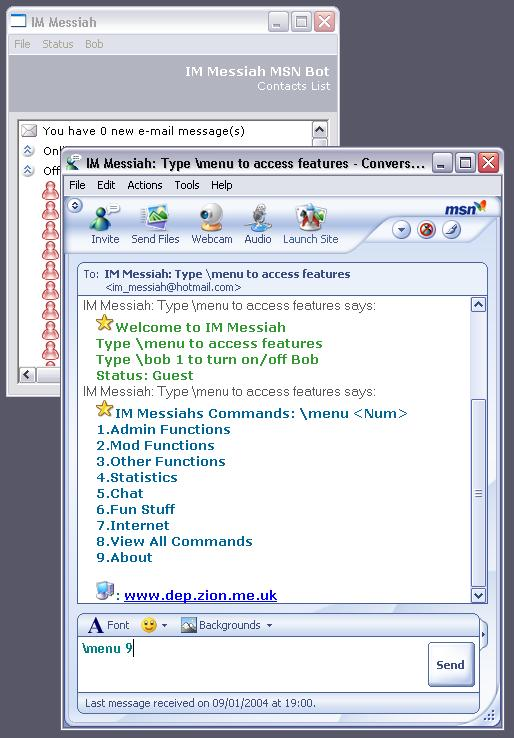



## IM Messiah, a proper MSN Bot

### Description

IM Messiah is a fully working MSN Messenger bot. This Bot contains functions that are only found in professional MSN Bots; such as an AI Bot(called Bob) that users can add to, 5 Games including Othello, performs Google searches and returns top results, A selection of Jokes and Quotes and links to other sites. For the Moderators and Admin's of the bot you can perform announcements, ban users, alter the bots status and Name... If even thats not enough you can even flood or crash peoples MSN Messengers using it. And all people have to do is add it to their MSN Contacts list to use the bot, easy... Look at the screenshot of what the bot looks like while being used in Messenger. Please Vote or leave a comment on what can be improved [Updated 20/01/04 - Includes More Commands,Fixed some of the bugs, Better Layout and Hopefully easier to Use]
 
### More Info
 

             |
---                |---
**Submitted On**   |2004-01-19 22:00:48
**By**             |[Kevin Pfister](https://github.com/Planet-Source-Code/PSCIndex/blob/master/ByAuthor/kevin-pfister.md)
**Level**          |Intermediate
**User Rating**    |4.9 (163 globes from 33 users)
**Compatibility**  |VB 5\.0, VB 6\.0
**Category**       |[Internet/ HTML](https://github.com/Planet-Source-Code/PSCIndex/blob/master/ByCategory/internet-html__1-34.md)
**World**          |[Visual Basic](https://github.com/Planet-Source-Code/PSCIndex/blob/master/ByWorld/visual-basic.md)
**Archive File**   |[IM\_Messiah1697121202004\.zip](https://github.com/Planet-Source-Code/kevin-pfister-im-messiah-a-proper-msn-bot__1-50887/archive/master.zip)

